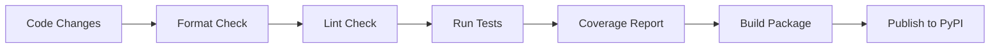

# MohFlow Technical Plan

## Project Overview

**MohFlow** is a Python logging library that provides structured JSON logging with multiple output handlers including console, file, and Grafana Loki integration. Currently at version 0.1.3, it's designed for easy setup with sensible defaults while providing powerful logging capabilities for modern Python applications.

## Architecture Analysis

### Core Components

#### Main Logger (`src/mohflow/logger/base.py`)

- **MohflowLogger**: Primary interface for logging operations
- Supports multiple log levels (INFO, ERROR, WARNING, DEBUG)
- JSON-formatted output with consistent schema
- Handler management for different output destinations

#### Configuration Management (`src/mohflow/config.py`)

- **LogConfig**: Pydantic-based configuration with environment variable support
- Environment prefix: `MOHFLOW_`
- Validation and type safety for configuration parameters
- Support for multiple environments (development, production)

#### Handler System (`src/mohflow/handlers/`)

- **LokiHandler**: Integration with Grafana Loki for centralized logging
- Extensible handler architecture for future integrations
- Error handling and configuration validation

#### Exception Handling (`src/mohflow/exceptions.py`)

- Custom exception hierarchy with `MohflowError` base class
- `ConfigurationError` for setup and configuration issues

### Dependencies

#### Core Dependencies

- `python-logging-loki>=0.3.1`: Loki integration
- `python-json-logger>=2.0.0`: JSON formatting
- `pydantic>=2.0.0`: Configuration validation
- `pydantic-settings>=2.0.0`: Environment-based settings

#### Development Dependencies

- `pytest>=7.0.0`: Testing framework
- `black>=23.0.0`: Code formatting
- `flake8>=6.0.0`: Linting
- `build>=1.0.0`: Package building
- `twine>=4.0.0`: PyPI publishing
- `pytest-asyncio>=0.21.0`: Async testing support

## Current State Assessment

### Strengths

1. **Simple and Intuitive API**
   - Clean interface requiring minimal setup
   - Sensible defaults for quick development setup
   - Clear parameter naming and documentation

2. **Multiple Output Destinations**
   - Console logging for development
   - File logging for persistence
   - Loki integration for centralized log management
   - Extensible architecture for additional handlers

3. **Structured Logging**
   - Consistent JSON format across all handlers
   - Timestamp standardization
   - Field renaming and normalization
   - Rich context support through kwargs

4. **Configuration Management**
   - Environment variable support with `MOHFLOW_` prefix
   - Type-safe configuration with Pydantic
   - Validation and error handling
   - Multiple configuration methods (parameters, environment variables)

5. **Quality Assurance**
   - Comprehensive test suite with good coverage
   - CI/CD pipeline with GitHub Actions
   - Multi-version Python support (3.8-3.11)
   - Automated formatting and linting

6. **Package Management**
   - Published on PyPI
   - Automated releases via GitHub Actions
   - Proper versioning and changelog management

### Architecture Patterns

- **Factory Pattern**: Handler setup and configuration
- **Configuration Pattern**: Centralized settings management
- **Wrapper Pattern**: Abstracts Python's standard logging module
- **Decorator Pattern**: Handler composition and chaining

## Development Workflow

### Quality Assurance Pipeline

1. **Code Formatting**
   - Tool: Black
   - Line length: 79 characters
   - Python 3.8+ target version

2. **Linting**
   - Tool: Flake8
   - Configuration in `.flake8`
   - Enforces PEP 8 compliance

3. **Testing**
   - Framework: pytest
   - Coverage reporting with HTML output
   - Test organization by component
   - Async testing support

4. **Continuous Integration**
   - Platform: GitHub Actions
   - Matrix testing across Python versions (3.8, 3.9, 3.10, 3.11)
   - Automated PyPI publishing on tag push

### Build Process

## Technical Recommendations

### Immediate Improvements (Priority 1)

1. **Enhanced Error Handling**
   - Implement retry logic for Loki handler failures
   - Add circuit breaker pattern for external service failures
   - Graceful degradation when handlers are unavailable
   - Better error messages and troubleshooting information

2. **Performance Optimizations**
   - Implement batching for Loki logs to reduce network overhead
   - Add connection pooling for HTTP requests
   - Lazy initialization of handlers
   - Memory usage optimization for high-volume logging

3. **Async Support**
   - Add async logging methods for non-blocking operations
   - Async handler implementations
   - Background queue processing
   - Integration with asyncio applications

4. **Context Management**
   - Correlation ID support for distributed tracing
   - Request context preservation
   - Thread-safe context management
   - Structured context inheritance

### Architecture Enhancements (Priority 2)

1. **Plugin System**
   - Entry point-based handler discovery
   - Custom handler registration
   - Handler lifecycle management
   - Configuration schema validation for custom handlers

2. **Observability Features**
   - Logging metrics (rates, errors, latencies)
   - Handler health monitoring
   - Performance counters
   - Diagnostic endpoints

3. **Advanced Configuration**
   - Configuration file support (YAML, JSON, TOML)
   - Dynamic configuration reloading
   - Environment-specific configuration profiles
   - Configuration validation and schema documentation

4. **Handler Improvements**
   - Elasticsearch handler
   - Database handlers (PostgreSQL, MongoDB)
   - Cloud service integrations (AWS CloudWatch, GCP Logging)
   - Custom formatter support per handler

### Testing Strategy Enhancements (Priority 3)

1. **Integration Testing**
   - Real Loki instance testing in CI/CD
   - Docker-based integration test environment
   - End-to-end workflow testing
   - Handler failure scenario testing

2. **Performance Testing**
   - Logging throughput benchmarks
   - Memory usage profiling
   - Concurrency testing
   - Load testing under various conditions

3. **Quality Improvements**
   - Property-based testing with Hypothesis
   - Mutation testing for test quality assessment
   - Security vulnerability scanning
   - Dependency update automation

## Implementation Roadmap

### Phase 1: Stability and Performance (1-2 months)

- [ ] Enhanced error handling and retry logic
- [ ] Async logging support
- [ ] Performance optimizations (batching, connection pooling)
- [ ] Comprehensive integration tests

### Phase 2: Feature Expansion (2-3 months)

- [ ] Plugin system implementation
- [ ] Additional handler development
- [ ] Advanced configuration options
- [ ] Observability features

### Phase 3: Ecosystem Integration (3-4 months)

- [ ] Framework-specific integrations (FastAPI, Django, Flask)
- [ ] Cloud service handlers
- [ ] Advanced context management
- [ ] Performance monitoring and alerting

## Documentation Plan

### User Documentation

1. **Getting Started Guide**
   - Installation instructions
   - Basic configuration examples
   - Common use cases

2. **API Reference**
   - Auto-generated from docstrings
   - Parameter descriptions and examples
   - Return value documentation

3. **Integration Guides**
   - Framework-specific examples (FastAPI, Django, Flask)
   - Cloud deployment guides
   - Monitoring and alerting setup

4. **Best Practices**
   - Logging patterns and conventions
   - Performance optimization tips
   - Security considerations
   - Troubleshooting common issues

### Developer Documentation

1. **Architecture Documentation**
   - Component interaction diagrams
   - Handler development guide
   - Plugin system documentation

2. **Contributing Guidelines**
   - Development environment setup
   - Code style and conventions
   - Testing requirements
   - Release process

## Security Considerations

1. **Data Protection**
   - Sensitive data filtering
   - PII detection and masking
   - Encryption in transit (HTTPS for Loki)
   - Access control for log files

2. **Configuration Security**
   - Secure credential management
   - Environment variable validation
   - Configuration file permissions
   - Secret rotation support

## Monitoring and Metrics

1. **Library Health Metrics**
   - Handler success/failure rates
   - Logging throughput
   - Error frequency and types
   - Performance metrics

2. **Usage Analytics**
   - Handler adoption rates
   - Configuration patterns
   - Performance characteristics
   - User feedback integration

## Conclusion

MohFlow demonstrates solid engineering practices with a clean architecture, comprehensive testing, and good development workflow. The recommended improvements focus on enhancing reliability, performance, and extensibility while maintaining the library's core simplicity and ease of use.

The roadmap provides a structured approach to evolving the library while ensuring backward compatibility and maintaining high code quality standards. Implementation should prioritize stability and performance improvements before adding new features to ensure a robust foundation for future growth.